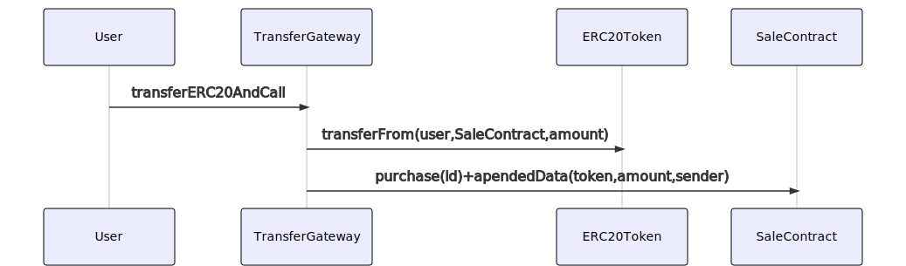
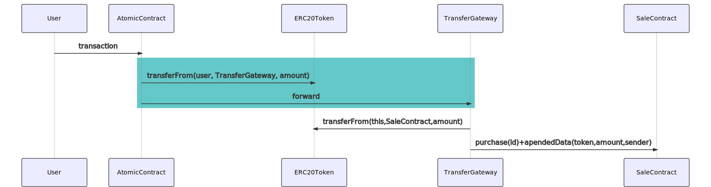

# Transfer Gateways

_Another way to solve the two step approve and transfer process_

Transfer gateways are intermediary contract that make the transfer to the destination contract before calling the contract.

They can be pre-approved globally as immutable address from the ERC20 contract (see \_gateway in [src/solc_0.7/Test/BaseERC20.sol](src/solc_0.7/Test/BaseERC20.sol)) so ERC20 contract can benefit from it without requiring user confirmation.

Alternatively for existing contract, users can approve it only once and can then make purchase in any contract that support such gateways.

This technique is not exclusive to ERC20 and this repo also includes an ERC721 version.

Use case : https://mystery.market so we can deploy new sales contract without every time requiring approval for transferring ERC721 into it.

## How it works

Let say there is a Sale Contract that sell some things (represented by id) for a specific price

User create the data to make the call to SaleContract

```js
const {data, to} = await SaleContract.populateTransaction.purchase(1);
```

Then the User call the TransferGateway `transferERC20AndCall` function with the tokeen address and amount to transfer

As shown in the diagram below, this in turn

- perforrm a transfer on the token to send the token to the destination
- call the destination and append the data, namely the sender, token address and amount to the msg.data (same as in [EIP-2771](https://eips.ethereum.org/EIPS/eip-2771))



<!--
```
sequenceDiagram
	User->>TransferGateway:transferERC20AndCall
    TransferGateway->>ERC20Token: transferFrom(user,SaleContract,amount)
	TransferGateway->>SaleContract: purchase(id)+apendedData(token,amount,sender)
```
-->

## Alternative: forwarding

The Gateway also allow to operate without any approval, by letting the sender make an atomic call that first transfer the token to the gateway and then call `forward` as shown in the following diagram:



<!--
```
sequenceDiagram
	User->>AtomicContract:transaction
    rect rgb(100, 200, 200)
    AtomicContract->>ERC20Token: transferFrom(user, TransferGateway, amount)
    AtomicContract->>TransferGateway:forward
    end
    TransferGateway->>ERC20Token: transferFrom(this,SaleContract,amount)
	TransferGateway->>SaleContract: purchase(id)+apendedData(token,amount,sender)
```
-->

<!--BEGIN_TEST_COVERAGE_SUMMARY-->

## Test Coverage

|     | File | Statements |     | Functions |     | Branches |     | Lines |     |
| :-: | :--- | ---------: | --: | --------: | --: | -------: | --: | ----: | --: |
| :exclamation: | [ERC20TransferGateway.sol](src/solc_0.7/ERC20TransferGateway.sol) | 35.29% | 6/17 | 50% | 3/6 | - | - | 35.29% | 6/17 |
| :exclamation: | [ERC721TransferGateway.sol](src/solc_0.7/ERC721TransferGateway.sol) | 0% | 0/13 | 0% | 0/4 | - | - | 0% | 0/13 |

<!--END_TEST_COVERAGE_SUMMARY-->
